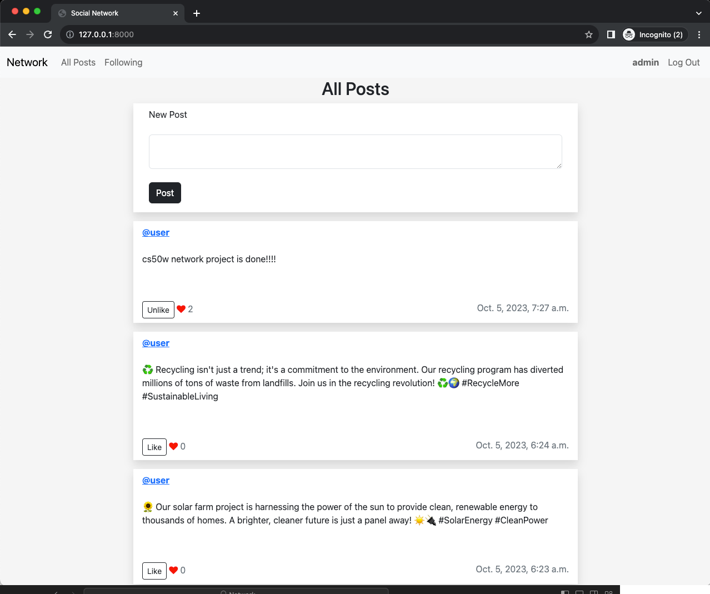
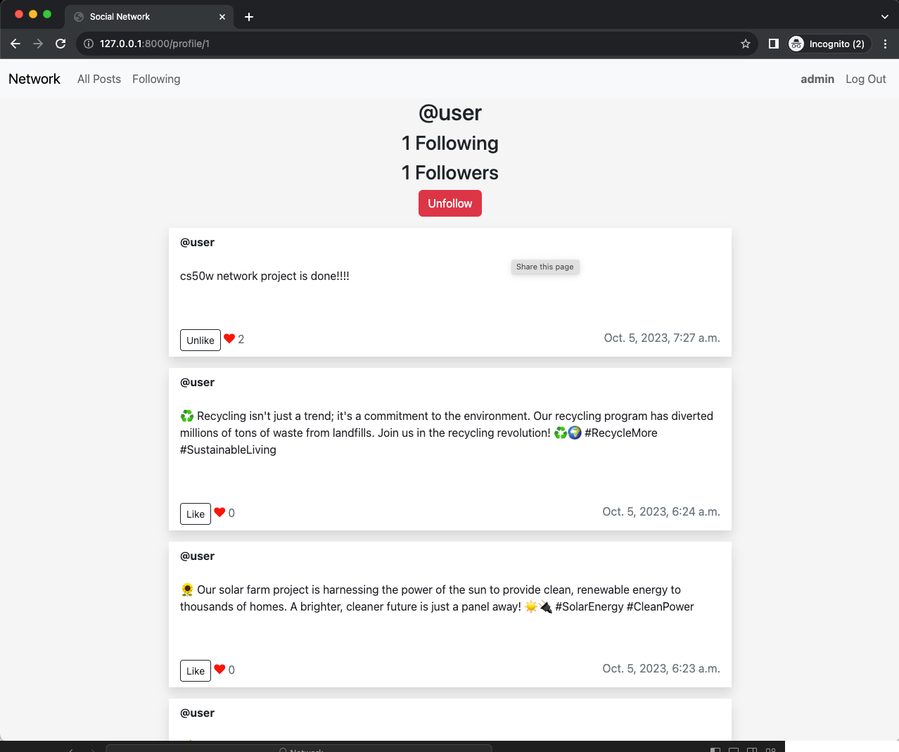

# CS50W-Project 4: Network
Network - Design a Twitter-like social network website for making posts and following users

### [Live website](https://yasingunay.eu.pythonanywhere.com/)

### [VIDEO DEMO](https://youtu.be/JjmdpVIU6w8?si=C2yAmu3G8QEbdLZI)

## Skills
* Javascript
* Fetch calls
* Django
* Python
* DOM
* HTML
* CSS

## Screenshots

### All Posts

### Profile Page

